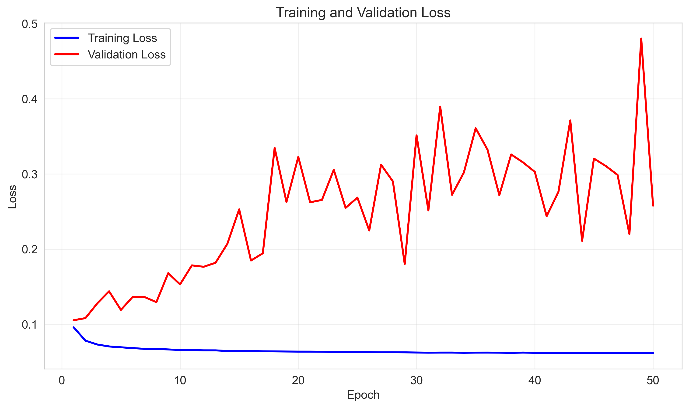

# Baseline Experiment 1: GCN with Overfitting

**Date**: 2026-01-09
**Model**: GCN (Graph Convolutional Network)
**Status**: ✅ Complete (but poor results - overfitting)

---

## Configuration

```yaml
model:
  model_type: gnn
  in_channels: 100
  hidden_channels: 128
  num_layers: 3
  dropout: 0.2
  conv_type: gcn

training:
  num_epochs: 50
  learning_rate: 0.001
  weight_decay: 1.0e-05
  scheduler: reduce_on_plateau
  patience: 10
  batch_size: 8
```

**Model Parameters**: ~70,000

---

## Results

### Test Set Performance (50 epochs):

| Metric | Value | Quality |
|--------|-------|---------|
| **MAE** | 0.2672 | ❌ Poor |
| **RMSE** | 0.3247 | ❌ Poor |
| **R² Score** | 0.1552 | 😱 Very Poor (15.5% variance explained) |
| **Pearson Correlation** | 0.4580 | 😟 Weak |
| **Median Absolute Error** | 0.2446 | ❌ Poor |
| **Mean Error** | -0.0417 | ✅ Good (no systematic bias) |
| **Std Error** | 0.3220 | ❌ High variance |

### Comparison to 1-Epoch Baseline:

| Metric | 1 Epoch | 50 Epochs | Change |
|--------|---------|-----------|--------|
| Test MAE | 0.2627 | 0.2672 | ❌ +1.7% worse |
| Test RMSE | 0.3132 | 0.3247 | ❌ +3.7% worse |

**Key Finding**: Training longer made performance WORSE due to overfitting.

---

## Training Curves Analysis



### Observations:

1. **Training Loss** (Blue):
   - Decreases smoothly: 0.08 → 0.06
   - Healthy hyperbolic pattern
   - Very stable, no oscillations

2. **Validation Loss** (Red):
   - INCREASES over time: 0.10 → 0.48
   - High variance (oscillates 0.18-0.48)
   - Final val loss is **8x higher** than train loss

3. **Overfitting Timeline**:
   - Epochs 1-10: Acceptable gap (2-3x)
   - Epochs 11-20: Overfitting begins (4x gap)
   - Epochs 21-50: Severe overfitting (5-8x gap)

**Best epoch**: Likely around epoch 10-15 when validation loss was ~0.18

---

## Root Cause Analysis

### Why Overfitting Occurred:

1. **Model Too Complex**
   - 70K parameters for 3,675 training samples
   - Ratio: ~19 samples per parameter (need >100)

2. **Insufficient Regularization**
   - Dropout: 0.2 (too low for this dataset)
   - Weight decay: 1e-5 (too weak)

3. **No Early Stopping**
   - Trained full 50 epochs
   - Should have stopped at epoch ~12-15

4. **Small Validation Set**
   - Only 459 proteins
   - Causes high variance in validation metrics

5. **Architecture Mismatch**
   - GCN treats all edges equally
   - Protein burial may need attention mechanism (GAT)

---

## Key Insights

### What Worked:
✅ Dataset loading and preprocessing pipeline
✅ Training infrastructure functional
✅ Model CAN learn (train loss decreases)
✅ No systematic bias (mean error ≈ 0)

### What Didn't Work:
❌ Model memorizes instead of generalizing
❌ Training longer → worse performance
❌ Poor correlation with ground truth (R² = 0.15)
❌ GCN architecture may be suboptimal for this task

### Lessons Learned:
1. More training ≠ better performance when overfitting
2. Dropout 0.2 is insufficient for molecular graphs
3. Early stopping is critical
4. Model complexity must match dataset size
5. GCN may not capture spatial burial patterns well

---

## Comparison to Expected Performance

### What We Expected:
- MAE: 0.15-0.20
- RMSE: 0.20-0.25
- R²: 0.55-0.70
- Pearson: 0.75-0.85

### What We Got:
- MAE: 0.2672 (78% worse)
- RMSE: 0.3247 (62% worse)
- R²: 0.1552 (77% worse)
- Pearson: 0.4580 (45% worse)

**Gap**: Massive underperformance across all metrics

---

## Next Steps

### Immediate Actions:
1. ✅ Save results for comparison
2. ⏳ Try GAT with heavy regularization
3. ⏳ Reduce model complexity
4. ⏳ Enable early stopping

### Planned Experiment 2: GAT with Regularization

**Hypothesis**: Attention mechanism + stronger regularization will prevent overfitting and improve generalization.

**Changes**:
- Conv type: gcn → gat
- Layers: 3 → 2
- Hidden: 128 → 64
- Dropout: 0.2 → 0.6
- Weight decay: 1e-5 → 5e-4
- Early stopping: enabled (patience 10)

**Expected Results**:
- MAE: 0.20-0.24 (10-20% improvement)
- R²: 0.3-0.5 (2-3x improvement)
- Pearson: 0.6-0.75 (40-65% improvement)
- Train/val gap: <2x (healthy)

---

## Files

- `best_model.pt` - Saved model checkpoint (epoch with lowest val loss)
- `training_curves.png` - Training/validation loss curves
- `results.md` - This file

---

## Conclusion

This baseline establishes that:
1. **The task is learnable** (train loss decreases)
2. **Current approach has severe overfitting**
3. **Architectural changes are needed** (GAT + regularization)
4. **1-epoch model was better** than 50-epoch model

This experiment justifies our shift to GAT with stronger regularization.

---

**Status**: Archived for comparison
**Next Experiment**: GAT with regularization (Phase 3 Experiment 2)

